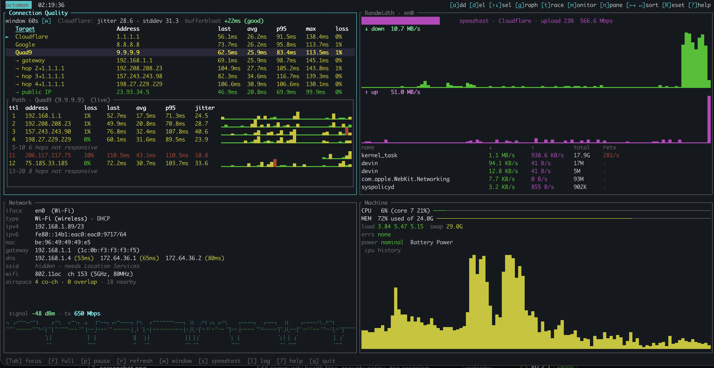

# octomon

**A `btop`-style terminal dashboard for your network.** Think `btop`, `trippy`, and
`bandwhich` in a single view — so you can tell at a glance whether it's the
network, the Wi-Fi, the ISP, or your own machine that's misbehaving.

[](https://github.com/securitypedant/octomon/actions/workflows/ci.yml)
[](#license)



## What it shows

Four panels, all updating live, all **unprivileged** (no `sudo`):

- **Connection Quality** — ICMP latency to configurable targets with a full
  distribution (last / avg / p95 / max), **jitter**, **packet loss**, and a
  **bufferbloat** grade (latency inflation under load). Auto-discovers your
  **gateway and the next hops** on startup, and can **traceroute** any target.
- **Bandwidth** — live up/down throughput, an on-demand **speed test** with a
  choice of provider (**Cloudflare / M-Lab / LibreSpeed**), and **per-process**
  talkers showing which apps are using the network (with retransmit rate and
  session totals).
- **Network** — interface, IP/DHCP, gateway, DNS, link type, Wi-Fi SSID/PHY/
  channel, plus a **live Wi-Fi signal graph** (RSSI / noise / tx-rate).
- **Machine** — CPU and memory, framed only as a "is my box the bottleneck?"
  signal.

## Platform support

- **macOS** — fully supported (this is the v1 target).
- **Linux** — planned for **release 2**. The collectors are already behind
  platform seams, but the macOS-specific probes (per-process bandwidth, Wi-Fi
  signal/details) are not yet wired up for Linux.
- **Windows** — later.

## Install

### Homebrew (macOS)

```sh
brew tap securitypedant/octomon
brew trust securitypedant/octomon   # one-time: acknowledge this third-party tap
brew install octomon
```

Then just `octomon`. Upgrade later with `brew upgrade octomon`.

### From source

Requires a recent Rust toolchain (1.88+):

```sh
git clone https://github.com/securitypedant/octomon
cd octomon
cargo build --release
./target/release/octomon
```

## Usage

```sh
octomon                      # launch the dashboard
octomon -t Home=192.168.1.1  # add extra ICMP targets (repeatable)
octomon --no-speedtest       # disable the speed test
octomon --ping-interval 500  # override the ping interval (ms)
octomon --check              # print a one-shot text snapshot and exit (no TUI)
octomon --help
```

### Keyboard shortcuts

| Key | Action |
|-----|--------|
| `Tab` / `Shift+Tab` | Cycle panel focus (forward / back) |
| `f` | Full-screen the focused panel |
| `s` | Run a speed test |
| `p` | Pause auto-refresh |
| `r` | Re-probe network info |
| `w` | Cycle the stats window (30 / 60 / 300s) |
| `?` | Help overlay |
| `q` / `Esc` | Quit |
| **Connection Quality** | |
| `a` / `d` | Add / delete a target (add accepts an IP or DNS name) |
| `↑` `↓` (or `j` `k`) | Select a target |
| `g` | Graph the selected target's latency |
| `t` | Traceroute the selected target |
| `←` `→` · `Enter` · `Space` | Move sort column · sort · toggle direction |
| `Shift+R` | Reset this panel's data |
| **Bandwidth** | |
| `v` | Cycle the speed-test provider (saved to config) |
| `←` `→` · `Enter` · `Space` | Sort top talkers by column |
| `Shift+R` | Reset this panel's data |

## Speed-test providers

`v` cycles between three providers, all working out of the box:

- **Cloudflare** — `speed.cloudflare.com`.
- **M-Lab** — NDT7 over WebSockets; a nearby server is chosen via M-Lab's
  locate service.
- **LibreSpeed** — a public server is picked automatically from the community
  server list (or point at your own with `librespeed_server`).

Each run measures download, upload, and **loaded-latency bufferbloat**, and is
saved to disk (see below).

## Configuration

On first run octomon writes a config file you can edit:

- **Config:** `~/.config/octomon/config.toml` (honours `$XDG_CONFIG_HOME`).
  Targets, ping timing, the selected speed-test provider, and endpoint URLs.
- **Data:** `~/.local/share/octomon/speedtests.jsonl` (honours
  `$XDG_DATA_HOME`). Timestamped speed-test history, one JSON object per line;
  the recent runs are shown in the full-screen Bandwidth view.

## How it works

Independent async collectors (Tokio) each sample on their own cadence and write
into a shared state that a Ratatui render loop draws — so a slow speed test
never stalls the UI. Latency uses unprivileged datagram ICMP (`surge-ping`);
per-process bandwidth reads `nettop`; Wi-Fi signal reads CoreWLAN directly; the
rest comes from `sysinfo` and `netdev`. Latency is validated to match the
system `ping`, so the jitter you see is the network's, not the tool's.

## Network & privacy

octomon is a read-only monitor, but as a *network* tool it does make outbound
requests. For transparency, here's everything it contacts and why:

| Endpoint | When | Why | Data sent |
|----------|------|-----|-----------|
| Your configured ICMP targets (default 1.1.1.1, 8.8.8.8, 9.9.9.9) | continuously | latency/loss | ICMP echo |
| `api.ipify.org` | once at startup | discover your public IP to add as a target | none (a GET) |
| `speed.cloudflare.com` | only when you press `s` (Cloudflare provider) | speed test | filler bytes |
| `locate.measurementlab.net` + a nearby M-Lab server | only when you press `s` (M-Lab provider) | speed test | filler bytes |
| `librespeed.org` server list + a public LibreSpeed server | only when you press `s` (LibreSpeed provider) | speed test | filler bytes |

Notes:

- **Speed tests are on-demand only** — octomon never runs them automatically, so
  it won't hammer public infrastructure.
- Third-party responses are read with a hard size cap.
- Nothing is sent to any octomon-operated service (there isn't one), and no
  telemetry is collected.
- Turn off public-IP discovery with `public_ip_url = ""`, or swap any endpoint,
  in `~/.config/octomon/config.toml`.

## Contributing

Issues and PRs welcome — see [CONTRIBUTING.md](CONTRIBUTING.md). `cargo fmt`,
`cargo clippy`, and `cargo test` should all be clean (CI enforces this). Please
follow the [Code of Conduct](CODE_OF_CONDUCT.md); report security issues per
[SECURITY.md](SECURITY.md).

## License

Licensed under either of

- MIT license ([LICENSE-MIT](LICENSE-MIT))
- Apache License, Version 2.0 ([LICENSE-APACHE](LICENSE-APACHE))

at your option.
