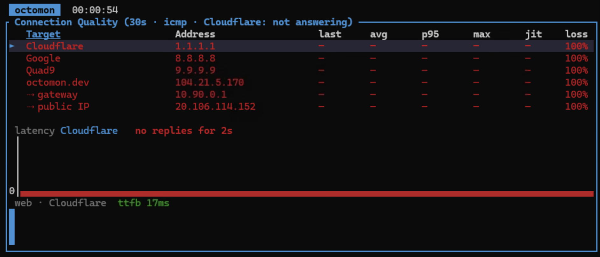
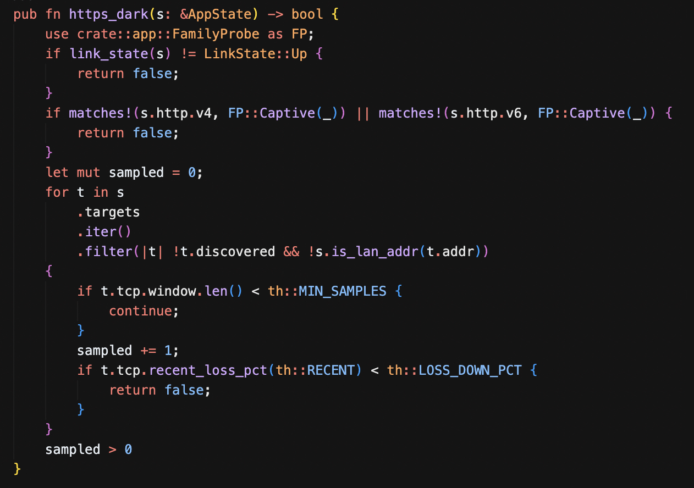
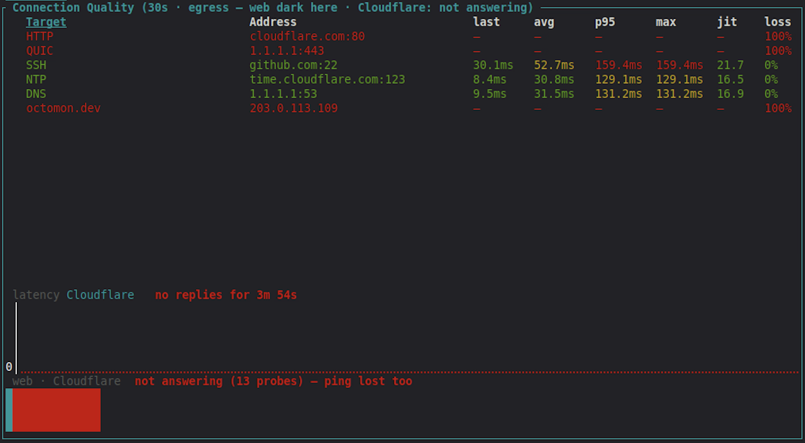
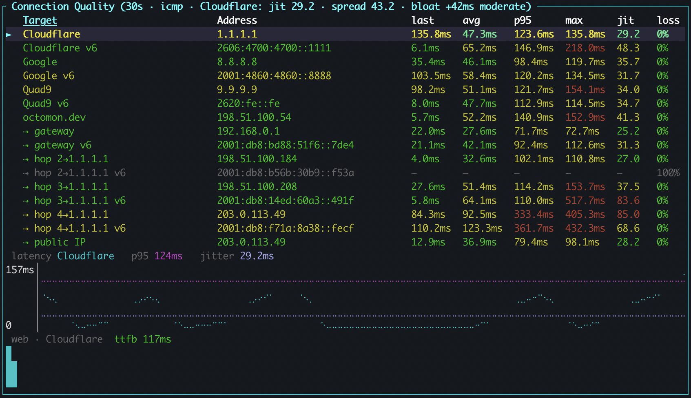

Darn. I didn't want to add any net new functionality. I thought I had this all buttoned up for 
a V1 release, I just needed a LOT of testing and feedback... 

But then I spent the last few weeks testing octomon on Windows desktops, one of them a Windows 11 VM 
in Azure, and I learned that in the Azure environment I was using, it drops every ICMP packet. Not most of them, all of them. 
I don't think this is the default behavior for Azure, but it is for the deployment I had access to. 
The gateway does not answer, the monitoring targets do not answer, a traceroute is silent,
but this only applies to ICMP, the web and other traffic was fine.

octomon already knew about networks like this. TCP connect probes to port
443 exist for this reason, and the analysis has a "degraded but usable" reading
for the plane and hotel case, where pings are mostly lost and the web
still gets through. What I had not thought about was the difference between
*mostly* and *entirely*.

## Every ping consistently lost is not heavy loss

On the plane, 40% ping loss is a product of satellite communication at over 400mph 
and likely 200 people on the plane all trying to watch YouTube. Even a 90% loss is terrible but some traffic is still getting through (just). Web access stalls, emails arrive slowly, and "degraded but usable" is the honest reading.

On the Azure VM, 100% ping loss is a policy. The connection is not degraded at
all; the TCP probes to web servers showed 11 ms and 0% loss. But octomon was folding the
lack of ping responses into the same "heavy packet loss" finding, the footer 
showing the history of connection quality stayed amber, and in my testing
the session bar had been amber for the entire time octomon was running. Which means
that information is no longer useful.

<figure>
  
  <figcaption>A Windows VM I had in Azure dropped every ping. (Not usually the case with default Azure VMs.)</figcaption>
</figure>

So that reading is now reserved for partial loss. When every monitoring target is at 100% loss
and the web check works, the ping-driven claims are simply dropped: they were
measuring the policy, not the connection. The ladder says "not measurable"
where it used to say 100% loss, the Internet and destinations rungs are judged on
the TCP series, and the footer goes green. A network that blocks ICMP is not a
sick network. It is just one you have to measure differently.

A smaller item came out of the same VM. I was using a Cloudflare WARP tunnel that
was handing out an IPv6 address but then did not route IPv6 traffic, and the "IPv6 broken
while IPv4 works" finding was, correctly, standing all day. But it was also
painting the bar amber while the performance grade said excellent. A tunnel
that only carries v4 is how that tunnel is built, the same as a v4-only LAN,
which raises nothing at all. So it is now a note in the analysis, no longer the connection's colour. 
More about IPv6 later...

## What if web traffic is also failing?

If ICMP fails, octomon falls back to TCP on port 443. But what if the network
is filtering the web? Corporate networks and guest networks can sometimes do this.
So ICMP fails, port 443 fails, the web check fails, and octomon would have
read all of that as the Internet being unreachable, while SSH, NTP and DNS were maybe
working fine. I wanted to improve octomon's diagnosis of this situation.

<figure>
  
  <figcaption>New detection code to see if web server checks are passing or failing.</figcaption>
</figure>

The fix has two halves, and the first half was already there. octomon probes a
public reference resolver alongside your system's DNS, to tell "your DNS is
broken" apart from "this network forces its own DNS". A reference resolver
answering over UDP 53 is a packet crossing the Internet and coming back, which
is proof the path is up, so it now counts as one. I also added the Google resolver so we now have
1.1.1.1 and 8.8.8.8, partly so one provider's bad day is not mistaken for the
path being down, and partly because a network that hands out 1.1.1.1 as its
own resolver used to leave octomon with no reference at all.

The second half is new. When port 443 stops answering to every monitoring
target, whatever pings and plain HTTP are doing, octomon starts an egress
monitor: five rows, HTTP on port 80, QUIC,
SSH, NTP and DNS, each against a host that reliably answers, probed every five
seconds until port 443 comes back. It is a handshake or one datagram per row,
it only ever runs while port 443 is dead everywhere, and it announces itself on the timeline,
both when it starts and when it stops. The target hosts are yours to change in the config, and you can turn the whole thing off if you want.

<figure>
  
  <figcaption>When there is no ICMP or TCP:443, octomon probes alternative ports.</figcaption>
</figure>

With that evidence the analysis can say what is actually true:

▲ web blocked on this network, SSH, NTP and DNS get out; HTTP and QUIC blocked

The session bar shows amber rather than red.
The Connection Quality table switches to the monitor's rows, so there is still
a live view of what the connection can do, with the targets you added kept
underneath. And port 80 open while 443 is dead gets its own wording, because
that is the signature of a filter that only allows what it can inspect.

## And then IPv6

While all of this was going on I switched IPv6 on for my home network, and
it was clear I needed to improve how octomon handles IPv6. It was broken for the
web check over v6 and the presence of a v6 route. It could say IPv6 was
broken but could not say where, and didn't really confirm if IPv6 was working at all.

So after some reading up on IPv6 (to be honest I spend so much time in IPv4 that I needed to bolster my knowledge), 
I added a range of IPv6 checks. When the interface holds a global IPv6 address, octomon now probes the IPv6 side of everything it already probes over v4:

- The three built-in targets get their operators' v6 addresses as twins,
  2606:4700:4700::1111, 2001:4860:4860::8888 and 2620:fe::fe, pinged with ICMP and
  handshaked on TCP:443 like their v4 variants, and shown directly under them.
- The v6 default router is pinged, at the global address the v6 walk sees it 
  answer from, and shows as 'gateway v6' under the v4 gateway.
- A second traceroute walks the v6 path, so both paths appear on a
  dual-stack link.
- The public IPv6 address is fetched from api64.ipify.org over a client
  pinned to v6, so it comes back as a v6 address or not at all. Asked
  unpinned, that endpoint quietly answers over v4 when v6 does not get out,
  which is precisely the case you wanted to know about.
- The path-MTU check runs per family. This is the quiet probe that finds the largest packet that gets through without being fragmented, not the traceroute. I found out that macOS ignores Don't-Fragment on v4, so on Macs that check has always read "cannot be measured", while Linux gives a number. v6 never fragments on the path by design, so the v6 check gives Mac users a real MTU reading for the first time.
- The Cloudflare based edge check asks octomon.dev once per family, so the "over v6" PoP and
  round trip sit beside the v4 ones.
- The port scan adds five v6 rows.

With the router and the targets IPv6 twins both answering, the analysis gets an IPv6 row
that says "works end to end". With the router answering and the twins silent,
the "IPv6 broken while IPv4 works" finding now reads "beyond the router: the
v6 gateway answers, nothing past it does", which is the difference between
reconfiguring your router and phoning your ISP. And the web answering over v6
while pings do not is named for what it is, ICMPv6 filtered, not v6 broken.

<figure>
  
  <figcaption>A packed quality panel with lots of IPv6 checks. (Disable with <code>probe_ipv6 = false</code> in your config.)</figcaption>
</figure>

## What next?

I'm happy with the current state of features for octomon, so now I need to test
on as many different networks as possible to make sure it works in all cases. 
I could do with some help here, so please run octomon in your own environment
and open a [github issue](https://github.com/securitypedant/octomon/issues) with the results if you encounter any problems.
