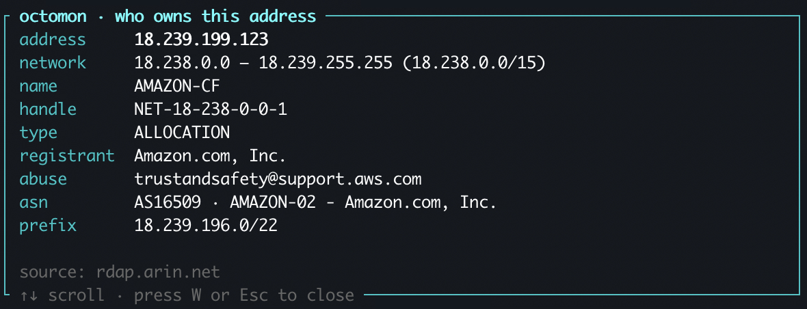
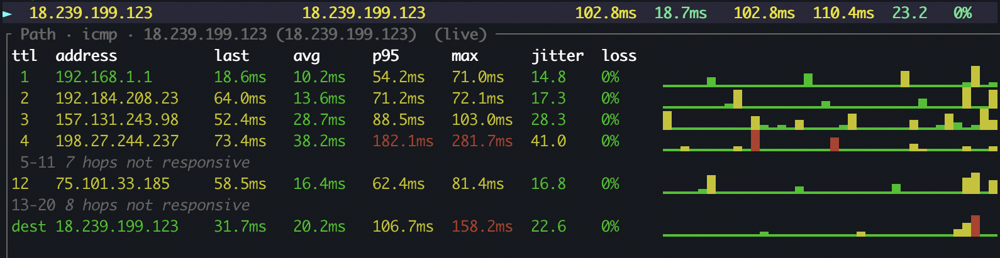

I hear it a lot from my kids... "Agghhh the lag!" I'm a networking professional
and have spent a lot of time making my home network run smoothly (along with
an unhealthy addiction to UniFi gear). So when my sons blame the network, I 
have to prove it's not MY network, but something on the Internet.

This is the thing octomon is for. Not to make the game faster, it cannot do
that, but to answer one question quickly: is the lag on my network or is it 
closer to the game servers? It works for any online game,
Fortnite is just the one that gets played the most in our house.

Before we get into the details of the tool, it's important to understand the different parts of the network path and where lag can occur.

<figure>
  
  <figcaption>Every packet in the match crosses all of this. The question is which stretch is losing them.</figcaption>
</figure>

So how do you use this tool? Typically, you want to run it on the computer you are playing on. If you are a console user, you can run this on a PC or laptop at the same time, but it won't be quite as useful.

Watch a video of me explaining how this whole thing works.

<iframe class="video-frame"
  src="https://www.youtube-nocookie.com/embed/bH9Jj0i5hDw"
  title="Is Fortnite lag your network or their servers? Find out with octomon"
  loading="lazy"
  allow="encrypted-media; picture-in-picture; fullscreen"
  allowfullscreen
  referrerpolicy="strict-origin-when-cross-origin"></iframe>

## 1. Start octomon before you start the game

octomon learns what your network normally looks like, so start it first for 
10 mins before you start playing.
Open a terminal, run `octomon`, and look at the title of the Network panel.
It will say something like "Network · learning 2/5m". After five 
minutes (without any network issues) it drops the "learning" and from then on its network analysis is judged against *your* normal. While it learns, press `N` and give the network a name, e.g. "Home". 

## 2. Start the game and find its traffic

Start Fortnite and get into a match. Now look at the Bandwidth panel in
octomon and press `f` to make it full screen. 
Below the graphs is the talkers table, the processes on your machine
that are moving packets. Press `/` and type `fortnite` to filter it, or just
find `FortniteClient` in the list. Put the cursor on it and press `p` to pin
it. A pinned row stays at the top while everything else churns. 

Press `n` to switch the table from processes to remotes. Now you are looking at
the addresses the game is talking to. There will be a handful: a few HTTPS
connections to Epic's services, and one address with a high port number, often
around 9000, carrying most of the traffic. That is the game server for the
match you are in. Use the same search with `/` and pin that one too. You want to find the address that has the most active network traffic.

When you have an address selected, press `W` to do a whois search. This gives you 
information about who the IP address is owned by. In my experience so far, 
Fortnite servers run on Amazon (AWS). So if your whois returns Amazon, you have the right one.

<figure>
  
  <figcaption>Press W on the busy address. Amazon as the registrant means you have found the game server.</figcaption>
</figure>

## 3. Add the game server to Connection Quality

With the cursor on the busiest remote IP address, press `a`. octomon offers that address as a new target for the Connection Quality panel. Press Enter and it appears
in the table with the built-in targets.

Sometimes the server might be shown in red, and that's fine. 
Game servers might never answer pings. They may ignore ICMP by policy, and the game works regardless. octomon knows this. I've found that most Fortnite game servers
do reply to pings.

The useful part is the path. Put the cursor on the game server row and press
`m`. octomon traces the route to it and then keeps pinging every hop along the
way, once a second, with a latency and loss graph per hop. Some hops
between your network and the server will likely be silent, that is the same ICMP policy at work, but the hops that matter are the ones you can see: your router, your ISP's first routers, the handoff into the cloud provider's network.

<figure>
  
  <figcaption>The path to the game server, monitored once a second. The silent stretches are routers that ignore pings; the hops that answer are the ones that matter.</figcaption>
</figure>

## 4. Play

Now play. If you have a second monitor, put octomon on it, and you will find
yourself glancing at it the way you glance at a clock. With one screen it is
harder, but the routine still works: leave octomon running behind the game,
and when the lag hits, alt-tab and look.

You do not need to have been watching. The bar along the bottom is a
timeline of the whole session, green, amber and red, and the analysis keeps a
history. Press `y` for the analysis, or `e` for the events timeline, and you
can see what octomon saw at the moment the game stuttered, even if that was
two minutes ago.

## 5. Reading the answer

**Everything green, path clean, and the game still lagged.** The footer says
connection healthy, the built-in targets are at their usual few milliseconds, the
monitored path to the game server shows no loss on any hop that answers. This
is the most common one at my house and it means the problem is not on your
side of the Internet. It is the server, the match, or the game. Nothing to
fix here and it's Epic's problem to solve.

**The gateway goes amber, or hop 1 shows loss.** The trouble is inside
your house. On Wi-Fi the Network panel shows the signal and the rate, and a
weak radio or a crowded channel will show as jitter and loss at the very first hop.
Move closer or plug in.

**Loss that begins at hop 2, 3 or 4 and carries through.** That is your ISP's
segment. octomon will say so in the analysis, "ISP path degraded, loss begins at
hop 3", because loss that starts at an ISP router and persists to every hop
after it means packets are going missing. This is the one you screenshot and send to your ISP.

**The built-in targets are fine but the path to the game server loses packets
deep in.** Your Internet is up, Cloudflare and Google answer perfectly, but
somewhere past your ISP the route to that particular server is dropping
packets. That is between the providers and the game's host, and there is
nothing to fix at home. Sometimes a new match lands you on a different server
and it goes away.

**The Machine panel is at 96% CPU.** Not the network at all. octomon shows
CPU, memory and the hottest core, and the analysis says "machine under load"
before it says anything about the connection. A game competing with a browser
full of tabs stutters without a single packet lost.

**Bandwidth spiking on a process that is not the game.** Something on your machine 
is downloading or uploading something. A backup to Google Drive maybe or a large Windows update. A saturated uplink turns into latency for
everything, and octomon names the process.

## What you end up with

Not a faster connection. What you get is the argument settled in the time it
takes to respawn. When the answer is "your side", octomon usually says which
part, and when the answer is "their side", maybe it's time to switch to another game.

The routine again, short version: start octomon and let it learn; start the
game; pin the game process in Bandwidth, switch to remotes, pin the busy one;
`a` to add it as a target; `m` to monitor the path; play; when it lags, look.
