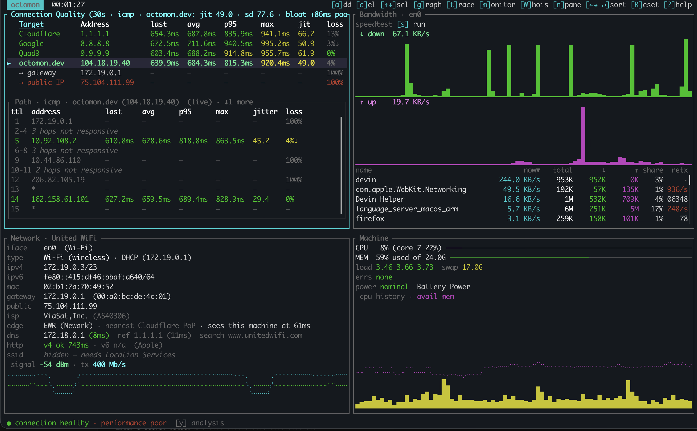
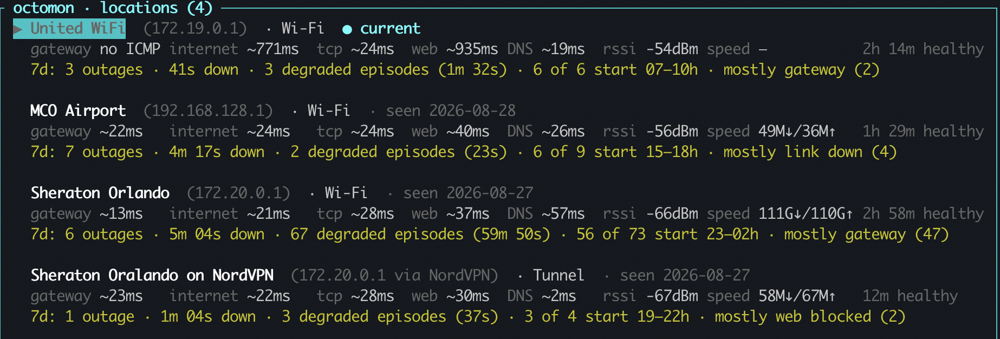
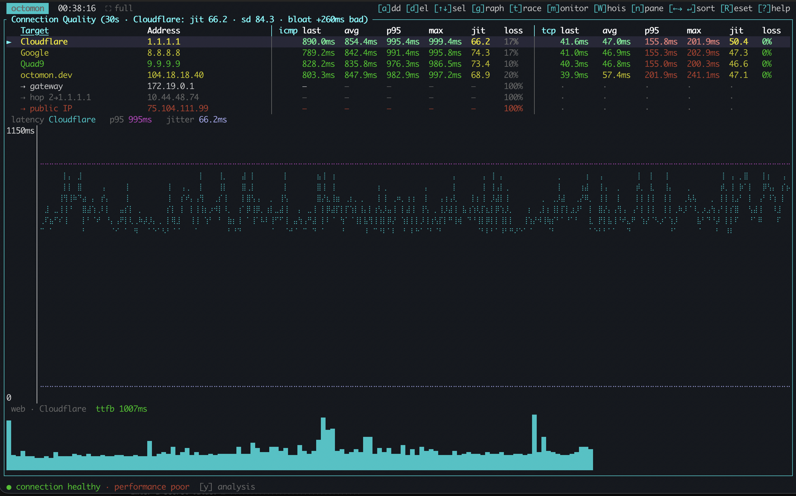
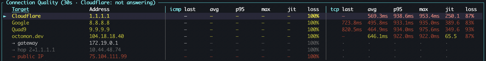

Many network tools were written by somebody sitting at a desk. You can tell,
because they all agree that 200 ms is bad. So I [wrote a tool](/blog/why-i-built-octomon/) to help me understand more about the quality of my Internet connection.

## A threshold is an opinion about where you are

At my desk at home, they are right. I have a Unifi [USW Flex XG](https://store.ui.com/us/en/products/usw-flex-xg)
switch connected to a copper to fibre converter, with a fibre run into my house terminating into a
[USW Pro XG 8 PoE](https://store.ui.com/us/en/products/usw-pro-xg-8-poe) that 
in turn connects to my [UCG Fibre](https://store.ui.com/us/en/category/cloud-gateways-compact/collections/cloud-gateway-fiber/products/ucg-fiber) that connects to my Sonic Internet, also fibre, obviously. (Yes, I have a bit of a Unifi problem...)

So if my connection to the Internet starts hitting 200 ms to a well-connected site
(Let's say a Fortnite server), something has gone wrong and I want to know within
seconds. (Or my kids are likely to tell me anyway, re Fortnite)

At 38,000 feet, 200 ms is the good case. A tool that colours it red has just
told me the Internet is broken, and it will keep telling me that for the rest of the
flight, along with loss figures that would be alarming anywhere else. By the
second hour I will have stopped reading it. A monitor you have trained yourself
to ignore is worse than no monitor at all, because you will also ignore it on
the day it is right. octomon is designed to be more informative about what's going on with your Internet connection.

<figure>
  
  <figcaption>United Airlines WiFi connection summary as I write this article.</figcaption>
</figure>

Hotel Wi-Fi is the mirror case. Perfectly fine at noon, congested every evening,
and a fixed threshold tuned to scream on the plane will say nothing useful about
the hotel, because the interesting thing there is a change, not a level.

This was the second gap I ran into, after the one that made me
[build octomon in the first place](/blog/why-i-built-octomon/).

## Learning a normal

So octomon fingerprints every network you join. On Wi-Fi that is the network name
plus the router's hardware address, so the identity survives address changes and
mesh roaming. On a wired link there is no name to use, so it is the router's
hardware address plus the kind of link, which is why Wi-Fi and Ethernet through
the same router are deliberately two different locations. VPNs get their own.

For each one it keeps a baseline: what latency normally runs at to the gateway
and out to the monitored Internet locations, the loss it normally carries, connect times,
[time to first byte](/understand#glossary), DNS timing, Wi-Fi signal, and what a
speed test tends to return there. Most of those are rolling averages of the last
minute rather than a single best case, and a finished speed test simply replaces
the old one. The session's own latency floor is a separate measurement, and the
two only meet at grading time, where the reference is whichever of them is lower.

Two rules keep that honest.

- A minute with an active fault never teaches the baseline. Learn during
the outage and the outage becomes normal, which is the failure you were trying
to avoid in the first place, just arriving more slowly. Lesser findings still
fold, some of them with the latency fields blanked out, because a slow minute is
not a broken one.

- Grading is relative with absolute floors. Latency within 1.5x of the path's
floor is fine and beyond 3x is bad; loss is judged tighter than that, fine below
1.5x of the learned normal and bad at 2x. The office-LAN absolutes are not a
fallback that learning eventually replaces, they are floors that always apply:
50 ms and 1% loss to go yellow, 150 ms and 5% to go red, however quiet the
network has taught octomon to expect. Learning can only ever loosen the grading,
never tighten it below those, and the learned normal does not get a vote at all
until five healthy minutes have gone into it. Relative alone would excuse
anything given enough time. Absolute alone is the desk-shaped tool I started out
annoyed by. You need both, and you need to say which one produced the verdict.

## Weather, not alarms

Some networks are simply like that. A satellite backhaul with a 600 ms floor is
not degraded, it is a satellite backhaul, and reporting it as a fault every
minute is a tool arguing with physics.

So once a degraded condition has stood for ten unbroken minutes, it stops
counting as an episode and becomes that location's weather. It does not vanish
from the footer, because it is still true and still worth seeing. What changes is
that it stops blocking the baseline, so the network location in octomon is finally allowed to learn
that this is its normal. From then on the comparison that survives is the one
that was always the useful one: worse than usual here.

This is also why the analysis changes its mind more slowly than the graphs do.
The graphs are raw truth, every second, deliberately. The analysis holds a state
until it has held across several evaluations, because one dropped ping is not an
outage and a verdict that repaints itself every second is noise, not judgement.

## You can see what it learned

Every location octomon has learned is listed in the app with its metrics and the
date it was last seen, because a baseline you cannot inspect is just a number
the tool made up and expects you to trust. If one is wrong, because you were
learning during a bad week, delete it and it learns again. The outage history for
that network deliberately stays behind: forgetting what normal looked like is not
the same as pretending nothing ever went wrong.

<figure>
  
  <figcaption>I flew to Orlando this week, you can see how each location has its own baseline.</figcaption>
</figure>

The same list is why switching networks is not disruptive. Move from the office
to the train and the comparison moves with you, rather than the train being
graded against the office.

## Usable, but degraded

Most tools have two states, working and broken, and plane Wi-Fi is neither.
As I write this, I'm flying home and the analysis says
● connection healthy ·
performance poor.
That's exactly my experience. (And oddly this accurately describes some of my personal relationships)

Loss is real and high. Ping-based measurement looks like an outage. Your mail
and your chat are going through anyway. Calling that an outage is not caution,
it is wrong, and calling it fine is also wrong. So there is a third
reading for exactly this case: usable, degraded, and here is what degraded looks
like on this network.

<figure>
  
  <figcaption>Detailed view of the icmp and tcp performances of the United Airlines Wi-Fi I am currently using.</figcaption>
</figure>

That reading is conditional, and the condition is the whole argument executing.
It only engages where the location is not already known to run clean, so at my
fibre desk the rule is switched off entirely and loss is reported loudly. It also
only demotes the claims that are driven by loss. A bufferbloat or latency
inflation finding is never quietly folded away, which is why the screenshot above
still says performance poor while the connection reads healthy.

That state is the whole argument in miniature. The tool is not there to protect
you from bad news, it is there to tell you what is actually happening, and on a
plane what is actually happening is that a very slow link is working quite hard.

Fast is not a property of a connection. It is a comparison, and octomon has to
know what it is comparing against. 200 ms at your fibre connected desk is a red flag. On a
satellite-backed hotel network whose normal is 200 ms, it is just Tuesday.

---

Anyway, the Wi-Fi has held up beautifully for the entire fli

<figure>
  
  <figcaption>Turns out plane Wi-Fi can also just be broken.</figcaption>
</figure>
