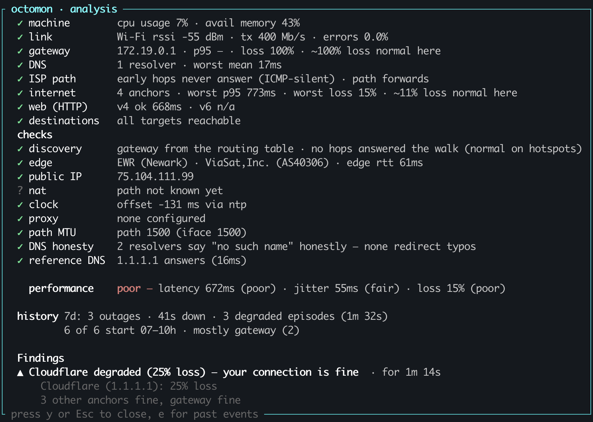

I run my own DNS at home as part of an Active Directory deployment. I don't know
if I even need it anymore, or if I could do something better, but it helps my 
family authenticate to the local NAS, I can apply some simple group policy and
a few other AD benefits. The domain controller runs in Proxmox, and sometimes
the server just hangs. I've not had time to really diagnose why, but when it does,
Internet connectivity is impacted (It's always DNS, am I right?). Then last month mice decided to chew through
the fiber cables for my Sonic fiber Internet connection and from my backyard office to the house.

<figure>
  
  <figcaption>Mice ate my fiber connection</figcaption>
</figure>

Within a minute I had four terminals open: ping to the
gateway, ping to 1.1.1.1, a traceroute crawling out somewhere past my ISP, a few dig lookups and
btop, because it is always worth ruling out my own laptop before blaming
anything else. Between them they gave me about nine numbers. None of them
answered the question I actually had, which was whether to keep waiting or give
up and tether to my phone.

I have been doing that for thirty years. So has everybody else.

So I created octomon: a btop-style terminal dashboard that puts
your whole Internet connection on one screen and names the layer at fault,
whether that is your Wi-Fi, your ISP or the Internet.

## The gap is not measurement

Every one of those tools is excellent, and every one of them is clear about a
narrow thing. `ping` tells you the round-trip time to one address. `traceroute`
gives you the path as it looked thirty seconds ago, with a wall of asterisks
where routers were told not to answer. `btop` reveals if your CPU is the problem.
`bandwhich` tells you which process is using the bandwidth. All true, all correct,
and all relied on me to connect the dots about what was going on with my Internet 
connectivity.

Over the years I've put together little Bash or Powershell scripts to combine 
these tools into some sort of analysis. The scripts were pretty good, 
but they were brittle and OS dependant. Then I turned to Python and started 
my own [homegrown ISP monitor](https://github.com/securitypedant/ispmonitor).
I wanted something to send to my ISP when things went wrong. But it wasn't 
really what I wanted and I had to deploy a whole webstack and expose access 
to it... it never went anywhere.

Recently I wanted to learn Rust. I started a few little projects with Claude Code
helping me learn as I built. Then the Internet went down again (Damn Proxmox server!) 
and I decided to combine my learning of Rust with the desire to build a decent CLI
based Internet connectivity tool.

## Introducing octomon

I love `btop`. One glance and I can see what's going on with my machine. I wanted
to recreate something similar, but to show everything related to my Internet connection.
A quick search of github, brew, Google, the usual places I go to find software, 
and I couldn't find an existing tool. So I started to create one. (Oh and also use AI to help me build it and learn Rust at the same time.)

I wanted to focus on two goals.

- Quickly display a summary of my Internet connectivity
- Triage the data collected and maybe generate a single opinion

## One screen instead of four

What replaced the four terminals is not all that clever. Connection quality, bandwidth,
network and machine performance, all on screen at once, each panel probing and grading its
own layer, with the analysis sitting on top and composing them into one answer. In
my 30 years of working in the technology industry, I've been a passionate UX designer (My first real job was designing game interfaces, anyone ever play [Championship Manager](https://en.wikipedia.org/wiki/Championship_Manager)?).
So I wanted the dashboard to look good and be easy to read. Note, when I say "easy
to read" I mean by a network or IT admin. octomon is built for people who already
know what a gateway, a resolver and a p95 are.

<figure>
  
  <figcaption>United Airlines WiFi connection summary as I write this article.</figcaption>
</figure>

The graphs deliver the raw data and are redrawn every second. The analysis is
deliberately slower than they are, because one dropped ping is not an outage,
and a verdict that repainted itself every second would be noise rather than
judgement.

## Making sense of the data

Your gateway might be dropping pings while every hop past it is clean: that's a
router with a policy, not an outage, and airport, hotel and office networks do
it constantly. Your resolver is slow but a public reference resolver answers
instantly from the same machine: that's a DNS problem, not a connectivity one,
and the fix is switching resolvers rather than phoning your ISP. Your CPU is
pinned and your throughput is down: the machine is a caveat printed next to the
network finding, not a reason to hide it. You are downloading an ISO: the
saturation is yours. Blaming the network for your own ISO download helps nobody.

I wanted something akin to the triage nurse in the ER (or A&E for my family back home). 
So I built some simple logic to try and rank the impact of the data points. 
No, this isn't some AI powered summary, it's just me hacking together some 
basic opinions. It's not perfect, but it's getting better and it's a lot better 
than my collection of scripts.

<figure>
  
  <figcaption>Still amazed how good Internet on a plane can be.</figcaption>
</figure>

I designed octomon to rank a symptom below its cause rather than letting it shout over
the top, it reports simultaneous causes rather than picking a favourite, and treats
a busy machine or an active VPN as a caveat instead of an excuse. Every finding
carries how long it has been going on, because "for six seconds" and "for forty
minutes" are different problems with different answers.

I'm on a plane right now and the analysis says
● connection healthy ·
performance poor.
That's pretty much my experience.

## The thing four terminals cannot know

I then realized another problem I didn't envisage. None of those tools knows where you are
sitting. `ping` does not know that 200 ms is a disaster on office fiber and a
good day on a plane, so it prints the number and leaves the arithmetic to you.
Get that math wrong and you spend an hour blaming an ISP that is fine.

octomon learns a normal for every network it joins and grades against that, with
absolute floors so that "relative to normal" cannot quietly excuse a network
that has been bad since you arrived. I actually think that argument needs its own 
post, so I wrote [one](/blog/plane-wifi-is-not-broken/).

## Why it lives in a terminal

Timing. Because I designed this primarily for people like me who understand networking.
I typically reach for a tool like this when something is already wrong, and that
is usually the worst possible moment to be asking for anything: somebody else's
network, a work laptop where you do not have admin, an SSH session into a box
you would rather not escalate on. A tool that demands root right then is a tool
you do not run. octomon runs unprivileged by design, never asks for a password,
and [tells you at startup](/understand) what that costs on your machine. I've been able to get
the vast majority of the functionality into running unprivileged, Linux and Windows
have a few quirks and I suspect most people might run these with sudo anyway.
But I wanted to try and avoid admin rights where I could.

The same reasoning covers what it refuses to be and the reason my Python Flask based
ISP monitor never really went anywhere. It is not an observability
platform and it does not want weeks of your network data. It answers one
question: how is this connection right now, and is that normal for where I am
sitting. What it keeps on disk exists to answer that question better tomorrow,
it stays on your disk, and [the whole list is written down](/privacy).

I did not want more numbers. There were already plenty of numbers. I wanted
something that would read them.

---

If you find octomon useful, a
[GitHub star](https://github.com/securitypedant/octomon) is much appreciated.
